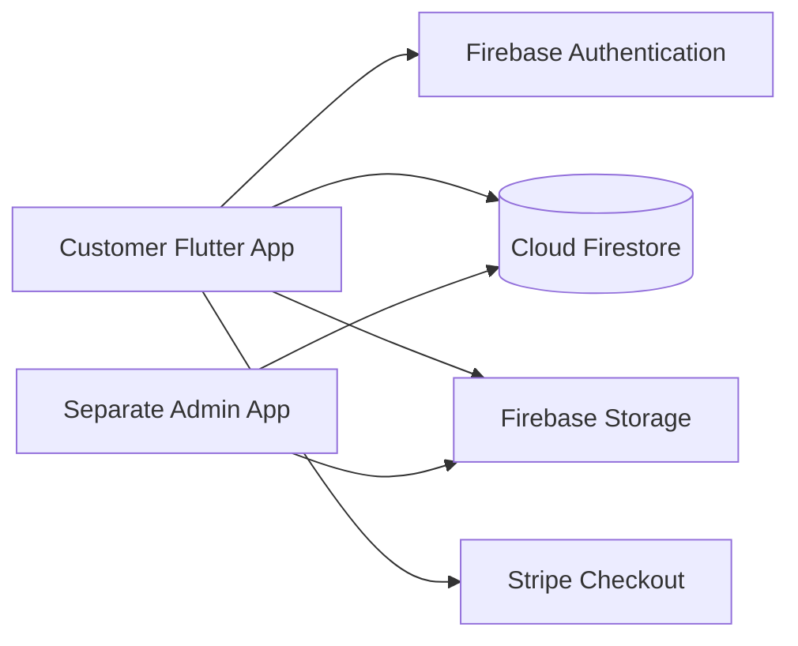

<div align="center">
  

# Grocerio

### Flutter Grocery E-Commerce Mobile App

A customer-facing grocery shopping application built with **Flutter** and **Firebase**, featuring product discovery, cart management, coupons, secure authentication, order tracking, and Stripe-powered checkout.

[](https://flutter.dev/)
[](https://dart.dev/)
[](https://firebase.google.com/)
[](https://stripe.com/)

</div>

---

## Overview

**Grocerio** is a mobile grocery e-commerce application designed to give customers a simple end-to-end shopping experience. Users can create an account, explore promotions and product categories, add items to their cart, apply coupons, complete checkout, and follow their order status.

The customer app is designed to work alongside a **separate admin application**. Both applications use the same Firebase-backed data so administrators can manage the content and operations that appear in the customer app.

> **Companion project:** The admin application should be published as a separate repository, for example `grocerio-admin`, and linked here once available.

## Key Features

### Customer Experience

- Email/password account registration and login
- Firebase-backed user profiles
- Editable delivery details and contact information
- Promotional carousel and featured banners
- Product browsing by category
- Product details with pricing, discounts, and stock availability
- Persistent shopping cart per authenticated user
- Quantity controls and cart item removal
- Coupon validation and percentage discounts
- Stripe payment sheet integration
- Order creation after successful checkout
- Automatic product stock reduction after purchase
- Personal order history
- Order detail view with live status information
- Logout and authenticated user session handling

### Admin Integration

The project is designed to work with a separate administrative application that manages the same commerce data used by the mobile client. Depending on the admin implementation, this can include:

- Products and inventory
- Product categories
- Coupons and discounts
- Promotional banners and offers
- Customer orders and order status
- User/customer information

Keeping the customer and admin applications in separate repositories makes each codebase easier to maintain, deploy, document, and showcase independently.

## Tech Stack

| Area | Technology |
|---|---|
| Mobile framework | Flutter |
| Language | Dart |
| Authentication | Firebase Authentication |
| Database | Cloud Firestore |
| Storage | Firebase Storage |
| State management | Provider |
| Payments | Stripe / `flutter_stripe` |
| Environment configuration | `flutter_dotenv` |
| UI components | Material 3, Carousel Slider |
| Date formatting | `intl` |

## Application Architecture

The app follows a lightweight separation between **views**, **view models**, **providers**, and **data models**.

```text
lib/
├── Providers/
│   ├── cart_provider.dart
│   └── user_providers.dart
├── models/
│   ├── cart_model.dart
│   ├── category_model.dart
│   ├── coupon_model.dart
│   ├── order_model.dart
│   ├── order_product_model.dart.dart
│   ├── product_model.dart
│   ├── promo_banner_model.dart
│   └── user_model.dart
├── viewModel/
│   ├── auth_view_model.dart
│   ├── cart_viewModel.dart
│   ├── categories_view_model.dart
│   ├── checkout_veiw_model.dart
│   ├── common_veiw_model.dart
│   ├── coupon_view_model.dart
│   ├── order_veiw_model.dart
│   ├── product_view_model.dart
│   ├── promo_banner_view_model.dart
│   └── user_view_model.dart
├── views/
│   ├── auth/
│   ├── buttonNav/
│   ├── checkout/
│   ├── coupons/
│   ├── products/
│   └── widgets/
├── firebase_options.dart
└── main.dart
```

### Shared Backend Model



The customer and admin applications communicate indirectly through the shared Firebase project. Changes made by the admin app can therefore be reflected in the customer experience through Firestore streams.

## Firestore Data

The current customer application interacts with collections including:

```text
users/
  {userId}/
    cart/

products/
categories/
coupons/
promos/
banners/
orders/
```

This structure supports user-specific carts while keeping catalog, promotional, coupon, and order data available through the shared backend.

## Getting Started

### Prerequisites

Before running the project, install:

- Flutter SDK compatible with Dart `^3.11.1`
- Android Studio and/or Xcode
- A configured Android emulator, iOS simulator, or physical device
- Firebase project access
- Stripe account for payment configuration

Confirm your Flutter environment:

```bash
flutter doctor
```

### 1. Clone the Repository

```bash
git clone https://github.com/YOUR_USERNAME/snap-shop-mobile.git
cd snap-shop-mobile
```

### 2. Install Dependencies

```bash
flutter pub get
```

### 3. Configure Firebase

The app initializes Firebase using `lib/firebase_options.dart`.

If you are configuring your own Firebase project, install and use the FlutterFire CLI, then regenerate the Firebase configuration for your platforms.

```bash
flutterfire configure
```

Make sure Firebase Authentication and Cloud Firestore are configured for your environment. Firebase Storage is also included as a project dependency.

### 4. Configure Environment Variables

Create your local environment file from the provided example:

```bash
cp .env.example .env
```

Then add your Stripe **publishable** key:

```env
STRIPE_PUBLISH_KEY=pk_test_your_publishable_key_here
```

The `.env` file is ignored by Git and must never be committed.

### 5. Run the App

```bash
flutter run
```

## Payment Security

> [!IMPORTANT]
> A Stripe **secret key must never be embedded in a Flutter/mobile application**.

The current checkout implementation contains client-side logic for creating a Stripe PaymentIntent. Before using this project in production or publishing a real secret, move PaymentIntent creation to a trusted server environment such as:

- Firebase Cloud Functions
- A Node.js / Express API
- Another secured backend service

The mobile app should send the order/payment request to that backend and receive only the client secret required by Stripe's mobile SDK.

**Never commit `STRIPE_SECRET_KEY` to GitHub or package it inside the app.** If a real secret key was previously committed to any public repository, rotate it from the Stripe dashboard.

## Admin Application

The administration interface is intentionally maintained as a separate application. This separation provides a cleaner permission boundary and allows the admin experience to evolve independently from the customer-facing mobile app.

Recommended repository layout:

```text
GitHub profile / organization
├── snap-shop-mobile      # Customer Flutter application
└── grocerio-admin        # Administrative application
```

Once the admin repository is published, add links in both READMEs so visitors can navigate between the two projects.

## Screenshots

For a portfolio-quality repository, add real screenshots from the running application under a directory such as:

```text
docs/screenshots/
├── login.png
├── home.png
├── products.png
├── cart.png
├── checkout.png
└── orders.png
```

Then showcase them in this section. Using real app screenshots is strongly recommended because it lets recruiters and collaborators understand the product immediately.

## Roadmap

- [ ] Move Stripe PaymentIntent creation to a secure backend
- [ ] Add automated widget and integration tests
- [ ] Add screenshots and/or a short demo GIF
- [ ] Add stronger form validation and error states
- [ ] Add search and product filtering
- [ ] Add push notifications for order updates
- [ ] Add favorites / wishlist support
- [ ] Add Firebase security rule documentation
- [ ] Link the companion admin repository

## Repository Safety

Before every public push, confirm that the repository does **not** contain:

- `.env` files
- Stripe secret keys
- Service-account private keys
- Keystore files
- Passwords or private tokens
- Local machine configuration files

The included `.gitignore` excludes the local `.env` file and common Flutter build artifacts.

## Contributing

Contributions and suggestions are welcome. A typical contribution workflow is:

1. Fork the repository.
2. Create a feature branch.
3. Commit your changes with a clear message.
4. Push the branch.
5. Open a pull request describing the change.

## Author

Developed as part of the **Grocerio** grocery e-commerce system.


- **Developer:** `RamaNael`
- **GitHub:** `https://github.com/RamaNael`

---

<div align="center">
  Built with Flutter, Firebase, and Stripe.
</div>
